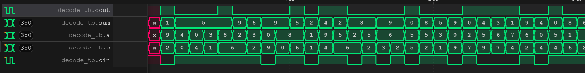

## Exercise 1: 4-bit BCD Full Adder

In this exercise, you will be tasked with implementing a 4-bit BCD full adder. The BCD full adder is a combinational circuit designed to add two 4-bit BCD numbers and generate both a 4-bit BCD sum and a carry bit. You must utilize the "always" statement to implement the combinational logic. Below is the module declaration for the BCD full adder. It is essential to ensure that all computation statements are enclosed within the "always" block, and no combinational logic should exist outside of this block.

```verilog
module bcdfadd4(
  input wire [3:0] a,
  input wire [3:0] b,
  input wire cin,
  output wire [3:0] sum,
  output wire cout
);
```

*Simulate your design locally.*
```shell
[ex01]$ iverilog -o ex01 simulation.v 
[ex01]$ ./ex01 
VCD info: dumpfile wave.vcd opened for output.
                   0  x  x x x  x
              100000  9  2 0 1  1
              200000  4  0 1 0  5
              300000  0  4 1 0  5
              400000  3  1 1 0  5
...
... omitted for brevity
...
             9600000  9  2 1 1  2
             9700000  8  5 1 1  4
             9800000  6  9 1 1  6
             9900000  2  2 1 0  5
            10000000  3  2 0 0  5
```

*You can also view the waveform (wave.vcd) using vscode' plugin.*


*Run the testing script to validate your solution.*
```shell
[ex01]$ python ../testing.py
Compilation successful.
VCD info: dumpfile wave.vcd opened for output.
                   0  x  x x x  x
              100000  9  2 0 1  1
              200000  4  0 1 0  5
              300000  0  4 1 0  5
              400000  3  1 1 0  5
              500000  8  6 1 1  5
...
... omitted for brevity
...
             9600000  9  2 1 1  2
             9700000  8  5 1 1  4
             9800000  6  9 1 1  6
             9900000  2  2 1 0  5
            10000000  3  2 0 0  5

Test PASSED.
```

