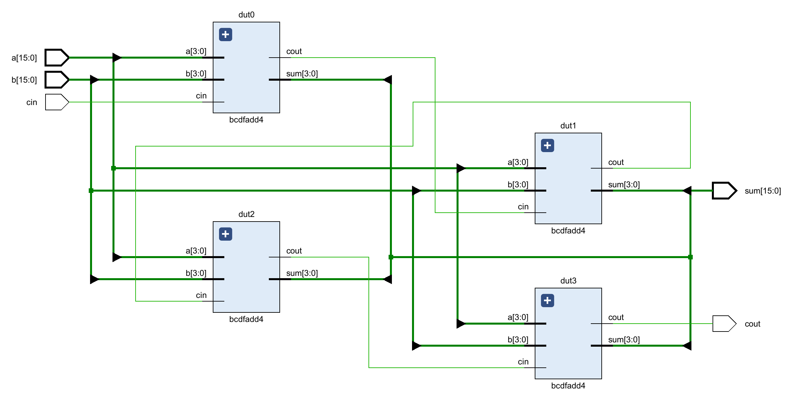
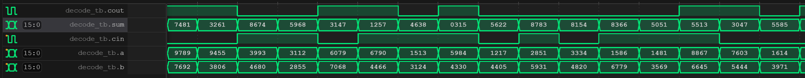

## Exercise 2: 16-bit BCD Full Adder

In this exercise, you will be tasked with implementing a 16-bit BCD full adder using structural-level Verilog. It's essential to have already completed Exercise 1, where you designed your 4-bit BCD full adder (`bcdfadd4`), as this exercise relies on it for completion.

```verilog
module bcdfadd16(
  input wire [15:0] a,
  input wire [15:0] b,
  input wire cin,
  output wire [15:0] sum,
  output wire cout
);
```

*Structural-level Design*


*Simulate your design locally.*
```shell
[ex02]$ iverilog -o ex02 simulation.v 
[ex02]$ ./ex02 
VCD info: dumpfile wave.vcd opened for output.
                   0 xxxx xxxx x x xxxx
              100000 7778 2577 1 1 0356
              200000 9789 7692 0 1 7481
              300000 9455 3806 0 1 3261
              400000 3993 4680 1 0 8674
...
... omitted for brevity
...
             9600000 7715 0014 1 0 7730
             9700000 5219 7357 1 1 2577
             9800000 6294 9078 0 1 5372
             9900000 6825 4670 1 1 1496
            10000000 2096 4039 1 0 6136
```

*You can also view the waveform (wave.vcd) using vscode' plugin.*


*Run the testing script to validate your solution.*
```shell
[ex02]$ python ../testing.py
Compilation successful.
VCD info: dumpfile wave.vcd opened for output.
                   0 xxxx xxxx x x xxxx
              100000 7778 2577 1 1 0356
              200000 9789 7692 0 1 7481
              300000 9455 3806 0 1 3261
              400000 3993 4680 1 0 8674
              500000 3112 2855 1 0 5968
              600000 6079 7068 0 1 3147
...
... omitted for brevity
...
             9600000 7715 0014 1 0 7730
             9700000 5219 7357 1 1 2577
             9800000 6294 9078 0 1 5372
             9900000 6825 4670 1 1 1496
            10000000 2096 4039 1 0 6136

Test PASSED.
```

