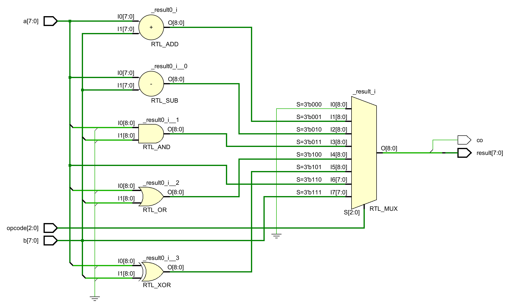
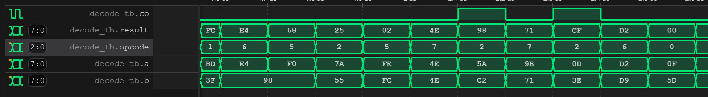
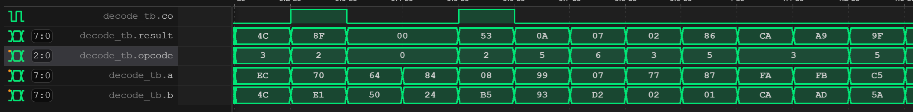

## Exercise 3: An 8-bit Arithmetic Logic Unit (ALU)

In this exercise, you will be constructing an 8-bit Arithmetic Logic Unit (ALU). The 8-bit ALU will possess the following interface and functions based on the opcode. The carry-out (CO) signal is utilized to signify overflow. Depending on the opcode ranging from 0 to 7, the ALU will carry out the following operations: zero (0), addition (add), subtraction (sub), bitwise AND (and), bitwise OR (or), bitwise XOR (xor), and finally, provide the inputs 'a' and 'b' directly to the ALU.

```verilog
module alu(
    input [7:0] a,
    input [7:0] b,
    input [2:0] opcode,
    output [7:0] result,
    output co
);
```

*Xilinx Vivado Synthesized Schematic*


*Simulate your design locally.*
```shell
[ex03]$ iverilog simulation.v 
[ex03]$ ./a.out 
VCD info: dumpfile wave.vcd opened for output.
                   0 xx xx x x xx
              100000 a6 a4 4 0 a6
              200000 2b d0 1 0 fb
              300000 9a c1 1 1 5b
              400000 0a cc 3 0 08
              500000 2f 61 5 0 4e
...
... omitted for brevity
...
             9700000 51 e3 7 0 e3
             9800000 7e da 3 0 5a
             9900000 25 f0 5 0 d5
            10000000 91 0f 0 0 00
```

*You can also view the waveform (wave.vcd) using vscode' plugin.*



*Run the testing script to validate your solution.*
```shell
[ex03]$ python ../testing.py
Compilation successful.
VCD info: dumpfile wave.vcd opened for output.
                   0 xx xx x x xx
              100000 a6 a4 4 0 a6
              200000 2b d0 1 0 fb
              300000 9a c1 1 1 5b
              400000 0a cc 3 0 08
              500000 2f 61 5 0 4e
...
... omitted for brevity
...
             9700000 51 e3 7 0 e3
             9800000 7e da 3 0 5a
             9900000 25 f0 5 0 d5
            10000000 91 0f 0 0 00

Test PASSED.
```

